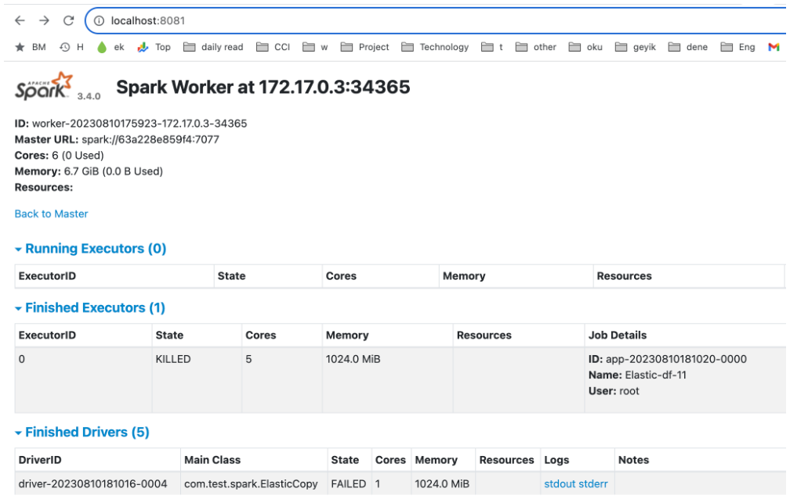
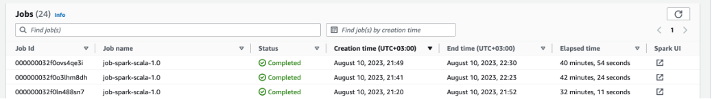

# Data and Streaming using Spark on EMR, ElasticSearch, Iceberg and ..

[This is part of series of](https://farukonder.github.io/thats-enough-cloud-for-today)

The other day, I was curious about whether I should start a composite project on my own to investigate alternative solutions for different kinds of platform needs in my current company. 

Given my responsibility for platform services, I want to delve into specifics such as data-at-rest services, integration, streaming, and NoSQL/NewSQL solutions.
In my company, there are separate Elasticsearch services for logging and searching purposes for every product. Especially for logging purposes, Elasticsearch services contain valuable data that can be utilized for fraud detection, campaign management, error tracking, monitoring, alerting, and more.

The nature of logging data on Elasticsearch is convenient for putting as data producer in my solution as streaming, searching, and transferring, as data on it is both huge and fast-increasing.

In the upcoming series, the plan might vary, but for now, let's begin by outlining and implementing a solution, illustrated as follows:


## why spark
first, I was considering to use Airflow. Apache Airflow is a very good solution for extract(E) and load(L) types of operations. As can be seen most of the operators are using local file system during data transfer as hop point. 
     
[source code from apache repo ](https://github.com/apache/airflow/blob/45548b9451fba4e48c6f0c0ba6050482c2ea2956/airflow/providers/apache/hive/transfers/hive_to_mysql.py#L99)
```python
if self.bulk_load:
            with NamedTemporaryFile() as tmp_file:
                hive.to_csv(
                    self.sql,
                    tmp_file.name,
                    delimiter="\t",
                    lineterminator="\n",
                    output_header=False,
                    hive_conf=hive_conf,
                )
                mysql = self._call_preoperator(local_infile=self.bulk_load)
                mysql.bulk_load(table=self.mysql_table, tmp_file=tmp_file.name)
```
if tmp folder on the machinne mounted to s3 or temp file created at s3, almost limitless size of data can be transfered with airflow without any issue.

But in terms of transform(T) for some cases we need to use Pandas with Python. Airflow is using Python. Pandas is not a distributed solution. Computation is executed locally on the workload it-self. So there should be some pagination patterns or the environment that airflow is running on should be big enough to  perform the transformation. 

On the other hand Spark is using RDD which is distributed by nature. The data being processed on Spark is distributed on many nodes by default. Both solutions are supporting DAG (better on Airflow) and fault tolerance and self healing, Airflow is better for data transfer and small transform so E-t-L and Spark is better for both E-T-L and e-T-l. 

Every product has pros and cons. Considering Airflow, a graphical interface for DAGs cis a benefit. But for our case Spark is the product. There is a solution named DataFrame and DataSet (DF) which turns the system to common SQL complaint layer. 

Later we are going to use Airflow the point at its good for. 

# demo time

## code

first part of demo is about to connect to elasticsearch from spark and get/put some data. With Spark we can use many programming languages although spark itself is written with scala. 

we are going to use both Python and Scala. Underneth of these integration methods there are some differences. 
- Scala : Elasticsearch has a  [library](https://www.elastic.co/guide/en/elasticsearch/hadoop/current/reference.html) for interaction with Hadoop. Library is using the core standart of the related platforms; split from may/reduce, shard from elasticsearch, partition from spark. those 3 are distributed computation system and can be integrated natively with this library.
- Python : Spark has native integraiton with hadoop systems. Python is using this hadoop layer to integrate elastic and hadoop. 

```scala
    val es_index_source = "index_source"
    val es_index_target = "index_target"
    val es_query = "?q=timestamp:(>=1691044482749 AND <=1691416124367)"
    val logsDF= sc.esDF(es_index_source,es_query)
    
    //magic happens here
    logsDF.saveToEs(es_index_target)
```
after defining spark session, then copying a data from one index to another index would be as easy as above.


while with scala we can you DF api, thru python we need to stick the down RDD layer, where python needs to use hadoop map/reduce layer to integrate with elastic and spark.

```python
    rdd = sc.newAPIHadoopRDD("org.elasticsearch.hadoop.mr.EsInputFormat",\
                             "org.apache.hadoop.io.NullWritable",\
                             "org.elasticsearch.hadoop.mr.LinkedMapWritable", conf=esConf)
    
    rdd.first()

    print('Total number of docs: %s' % rdd.count())
```

## setting up the spark env
### run on local spark

to run above code piece lets spin up a local spark first

```sh

## check out the repo first
git clone https://github.com/farukonder/thats-enough-cloud-for-today--emr.git

## go to jobs folder
cd jobs

## first job
cd job-spark-scala-1

## start
docker pull apache/spark:3.4.1
docker run -p18080:18080 -p4040:4040 -p8080:8080 -p7077:7077 -p8081:8081 -v"$(pwd)":/app --name local-spark-1 -it apache/spark:3.4.1 bash

## first settings

docker exec -it local-spark-1  bash

### inside container

#### spark settings

    mkdir /home/spark && chmod 777 /home/spark
    mkdir /opt/spark/conf && cp /app/spark-local-conf/spark-defaults.conf /opt/spark/conf/.

#### compile the project
    #sbt clean compile    // this stage is passed since its another topic

#### submit the application

    hostname
    #change the host name in blow script with "63a228e859f4"
    /opt/spark/bin/spark-submit   --packages org.elasticsearch:elasticsearch-spark-30_2.12:8.8.1  --deploy-mode cluster --master spark://63a228e859f4:7077     --class com.test.spark.ElasticCopy     /app/target/scala-2.12/job-spark-scala-1_2.12-0.1.0-SNAPSHOT.jar 80

#### incase you encounter an issue with some missing library run this
    cp /home/spark/.ivy2/jars/* /opt/spark/jars/.

```

after that you can experience with Spark locally.


## run on emr

AWS made a great job with EMR. open source distributed systems has some difficulties as its always moving so keeping up-to-date is a full time job for enterprises. From execution perspective assigning a resource is difficult since senior or experice resource need at this and comporate knowlage is also important. So EMR or alternative from azure and gcp are great Paas services from cloud vendors. 

AWS has a great community for tutorials and demos. there is a  [repo](https://github.com/awslabs/data-on-eks) which has great content. I have get the most of this part out of this repo. 

after setting up awscli locally with a powerfull user on aws account, then its really easy to setup all those great things with terraform script. 

```sh

## check out the repo first
git clone https://github.com/farukonder/thats-enough-cloud-for-today--emr.git

## go to emr folder
cd emr

## run the install script
## script uses models and executed them in order. "terraform apply" also can be used by you can expect some issues due to unordered execution. 
./install.sh

```

above script configures
- fundamentals like vpc etc.
- eks cluster and addons
- necessary eks configurations like iam roles, fargate profiles
- emr cluster (virtual)

after runnig the above script we will have spark cluster running on EKS which uses fargate as infra. at the end of the script you would have the cluster and role details like 

```json
configure_kubectl = "aws eks --region eu-central-1 update-kubeconfig --name emr-eks-fargate"
emr_on_eks = {
  "data-team-a" = {
    "cloudwatch_log_group_arn" = "arn:aws:logs:eu-central-1:1223334444:log-group:/emr-on-eks-logs/emr-workload/emr-data-team-a"
    "cloudwatch_log_group_name" = "/emr-on-eks-logs/emr-workload/emr-data-team-a"
    "job_execution_role_arn" = "arn:aws:iam::1223334444:role/emr-eks-fargate-emr-data-team-a"
    "job_execution_role_name" = "emr-eks-fargate-emr-data-team-a"
    "job_execution_role_unique_id" = "AROAVJWAXVFPCXEEGIHGR"
    "virtual_cluster_arn" = "arn:aws:emr-containers:eu-central-1:1223334444:/virtualclusters/n76sgyddy5q51z9jpvz6aw4g2"
    "virtual_cluster_id" = "n76sgyddy5q51z9jpvz6aw4g2"
  }
}
```

lets run the same job above again here EMR cluster

it has a similar fashion like local spark but wrapped with emr layer.
```sh

  aws emr-containers start-job-run \
    --virtual-cluster-id $EMR_EMR_VIRTUAL_CLUSTER_ID \
    --name $JOB_NAME \
    --execution-role-arn $EMR_JOB_EXECUTION_ROLE_ARN \
    --release-label $EMR_EKS_RELEASE_LABEL \
    --job-driver '{
        "sparkSubmitJobDriver": {
          "entryPoint": "s3://emr-for-middleware/job-spark-scala-1/target/scala-2.12/job-spark-scala-1_2.12-0.1.0-SNAPSHOT.jar",
          "entryPointArguments": ["'"$es_net_http_auth_user"'", 
                                  "'"$es_net_http_auth_pass"'",
                                  "'"$es_nodes"'",
                                  "'"$es_index_source"'",
                                  "'"$es_index_target"'",
                                  "'"$es_query"'"
                                 ],
          "sparkSubmitParameters": "--packages org.elasticsearch:elasticsearch-spark-30_2.12:8.8.1  --deploy-mode cluster   --class com.test.spark.ElasticCopy --conf spark.executor.instances=5 --conf spark.executor.memory=5G --conf spark.executor.cores=1 --conf spark.driver.cores=1"
        }
      }'
```

```sh
## first job
cd job-spark-scala-1

## env variables that for password etc.
../.env/export.sh

## submit the application to spark. this is scala app.
./job-spark-scala-1.sh

```

check the virtual cluster if app is submitted and running. 


in case an issue during job you would check the details with describe command

```sh
aws emr-containers describe-job-run --virtual-cluster-id cluster-id --id job-run-id
```


*references*
 - [great explanation about eks security details](https://catalog.us-east-1.prod.workshops.aws/workshops/165b0729-2791-4452-8920-53b734419050/en-US/2-identity-and-access-management/irsa/enable-irsa)
 - [although its archived great great details exist](https://archive.eksworkshop.com/advanced/430_emr_on_eks/fargate_2/)
 - [new workshop site for aws eks](https://www.eksworkshop.com/docs/introduction/)
 - [eks cluster access details very well explained](https://repost.aws/knowledge-center/amazon-eks-cluster-access)
 - [its about spark history server on emr to check the job details](https://aws.amazon.com/blogs/big-data/run-and-debug-apache-spark-applications-on-aws-with-amazon-emr-on-amazon-eks/)
 - [very usefull site](https://aws.github.io/aws-emr-containers-best-practices/submit-applications/docs/spark/pyspark/)
 - [package dependency on spark on emr](https://aws.amazon.com/blogs/aws/customize-and-package-dependencies-with-your-apache-spark-applications-on-amazon-emr-on-amazon-eks/)
 - [aws tuturials for emr](https://aws.amazon.com/emr/getting-started/?nc=sn&loc=4&dn=1)
